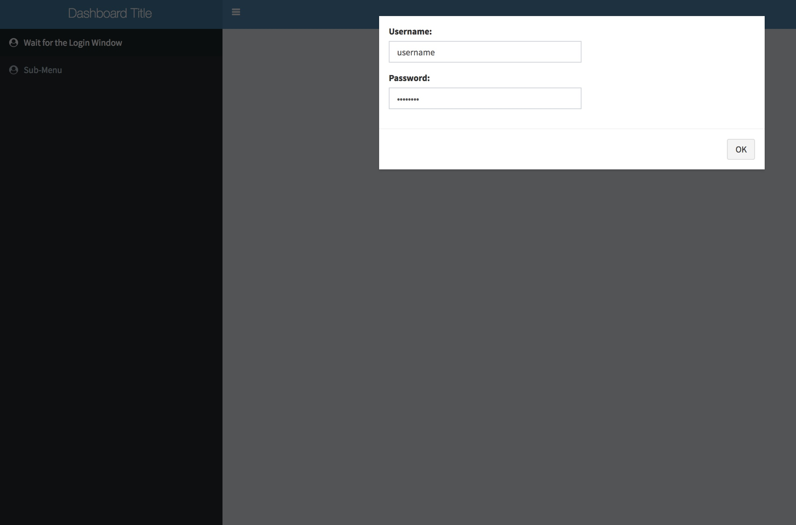
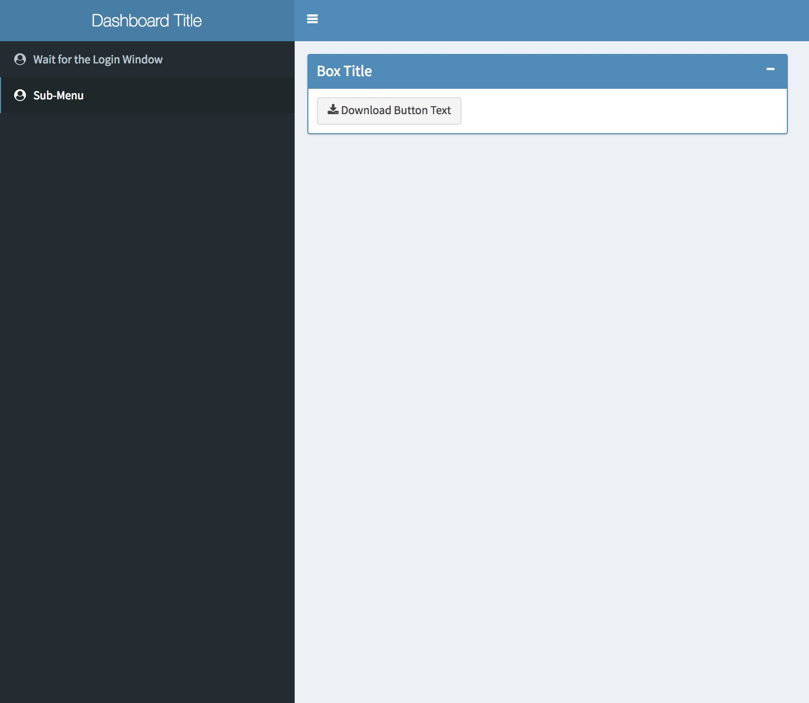

# RShiny Dashboard with password
This repository illustrates how to build a basic password protected dashboard in RShiny that will allow non-technical colleague to download DB information.

A Screenshot of the Login Page can be seen below:

A Screenshot of the Sub-Menu page with the Download button for the data stored in the DB can be found below:

